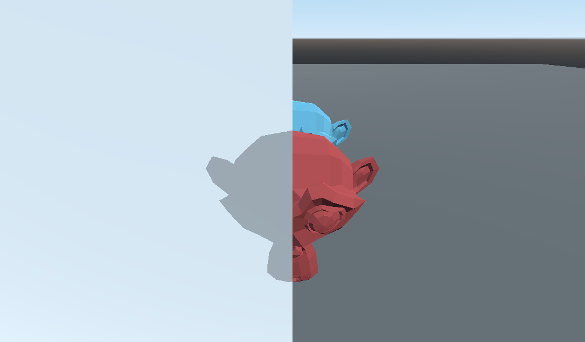
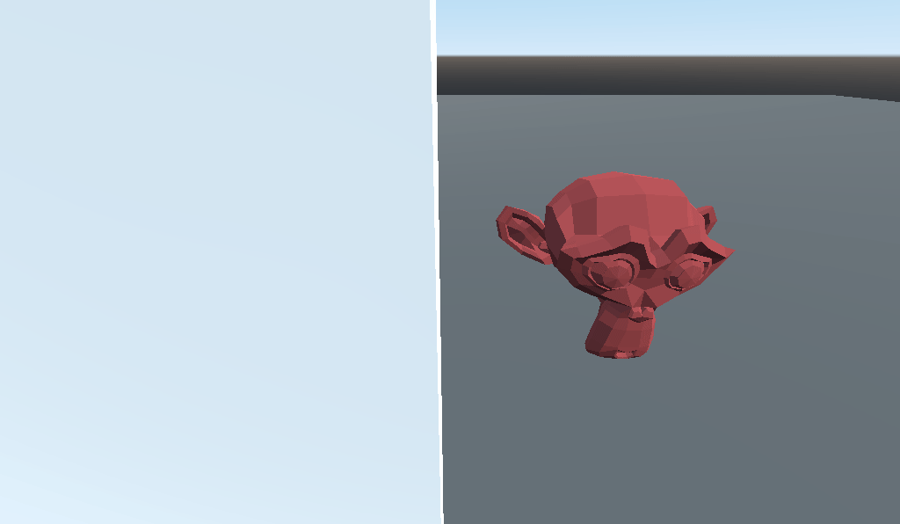
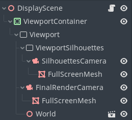

# Godot Silhouette Sample

Minimal sample project for Godot 3.5 showcasing Viewports, texture render targets, in order to achieve a Silhouette effect.

## Overview

The silhouette effect works by rendering the objects you want to have the silhouette effect twice. There's the depth-grabbing pass, which only draws the silhouette-able objects and gets the depth buffer, and the regular pass, which draws the world as usual, plus the silhouettes on top when applicable (given both depth buffers).

## Special thanks

I want to thank the people that helped with suggestions and problem-solving in the Godot Discord:

* [celyk 🔗[1]](https://github.com/celyk) [🔗[2]](https://celyk.github.io/website/shaders.html) [🔗[3]](https://godotshaders.com/author/celyk/)
* [Apples 🔗[1]](https://github.com/apples) [🔗[2]](https://alchemical.itch.io/) [🔗[3]](https://ldjam.com/users/alchemic/)
* [bruce965 🔗[1]](https://github.com/bruce965/)

## Scene structure

The game scene itself is in its own scene (`WorldScene`), and `DisplayScene` contains the interesting processing, with an instance of the `WorldScene`:

There are two viewports: The main `Viewport` that is shown to the screen, and an intermediate one that draws to a texture (`ViewportSilhouettes`), which contains the depth for the silhouette-able objects.

`DisplayScene` contains a script that initializes its cameras based on the camera inside the `World` scene, and updates them each frame. It also sets the `ViewportSilhouettes` world as the `Viewport` world, so that they render the same objects. This way, the `World` scene does all the game-related stuff, and the `DisplayScene` deals with the silhouette post-processing only.

## Layers

There are three layers: 

* **Layer 1**: World objects that should be rendered in the scene, regardless of whether they are silhouette-able or not. In the example scene they are the wall and floor, and both the blue and red models. 

* **Layer 2**: World objects that should be drawn as silhouettes when occluded. Only the red model acts this way.

* **Layer 3**: Objects to be rendered only in the depth-grabbing pass. This only includes the `FullScreenMesh` inside the `ViewportSilhouettes`.

Therefore, objects in the `World` scene should be in Layer 1, and optionally also Layer 2 if they want to draw their silhouettes when occluded.

## Cameras

There are two cameras. Both are have the same properties (Transform, Near, Far, Size) as the camera inside the `World` scene:

* **SilhouettesCamera**: Only renders the silhouette-able objects (Layer 2), and the fullscreen mesh with the `DepthToColor` shader (in Layer 3). Therefore this Camera ignores Layer 1.

* **FinalRenderCamera**: Ignores Layer 3, in order not to draw the fullscreen mesh used only for `SilhouettesCamera`.

The camera in the `WorldScene` is deactivated (`current` set to `false`) so that it doesn't actually render anything. However, the game can move it and change its properties in any way and the `DisplayScene.gd` script will mirror those properties to the rendering cameras. In this way, the game scene is agnostic of the silhouette rendering tricks.

## Shaders

There are two shaders involved in the process:

* **DepthToColor**: Attached to the `FullScreenMesh` in `ViewportSilhouettes`, it's only used to grab the depth buffer and pack it into the framebuffer as RGB. See the "Packing" section later.
  
* **FinalCombination**: Attached to the `FullScreenMesh` child of `FinalRenderCamera`, given the whole scene rendered as usual, plus the color buffer written by the `ViewportSilhouettes`, it adds silhouettes where appropriate.

#### `DepthToColor` shader: Packing 24-bit depth into RGB

Since depth is 24-bit and each of the RGB channels are 8-bit, in order not to lose precision, the depth is split into three 8-bit values (`FloatToRgb()` function) and that's the texture that's taken into the final render, which unpacks the RGB values into one float (`RgbToFloat()` function).

The reason this shader is needed is because you can't grab the depth buffer from a viewport, so this full screen shader that converts depth to color is the workaround.

#### `FinalCombination` shader: Occlusion silhouettes

The main depth logic is in this shader. If the depth written by `ViewportSilhouettes` is higher than the depth of the main scene render, the silhouette color is drawn. 

If the depth values are equal, it means that the object wasn't occluded in that fragment, and so the values are maintained. Similarly, if the silhouette depth is missing, no silhouette is drawn.

